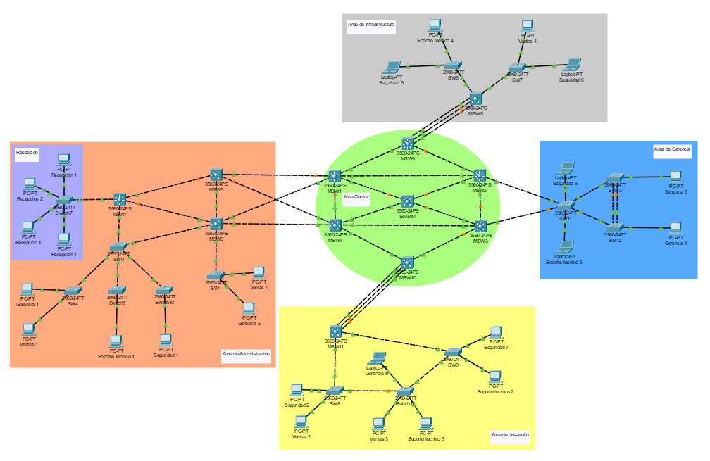
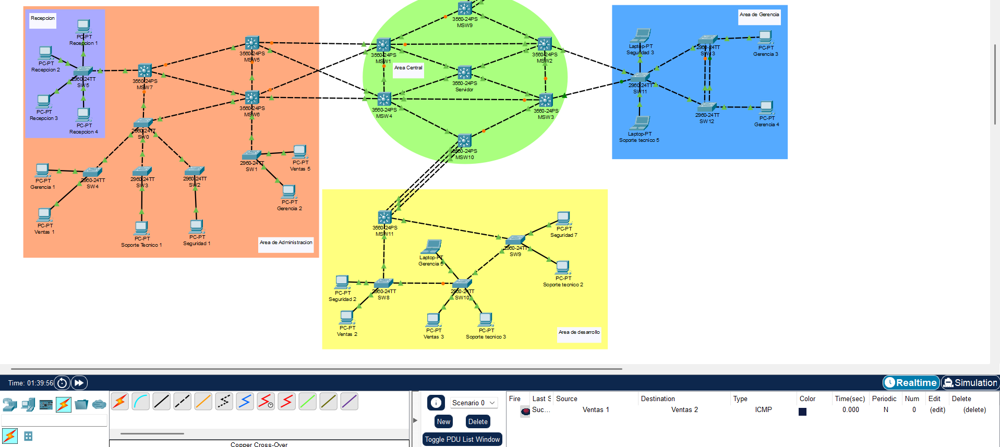
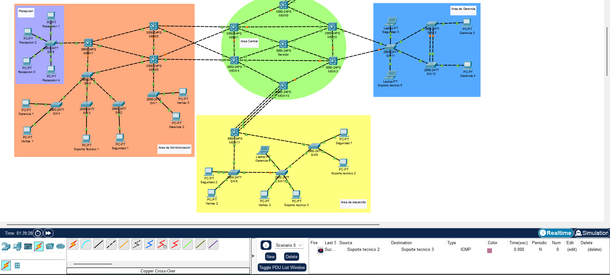
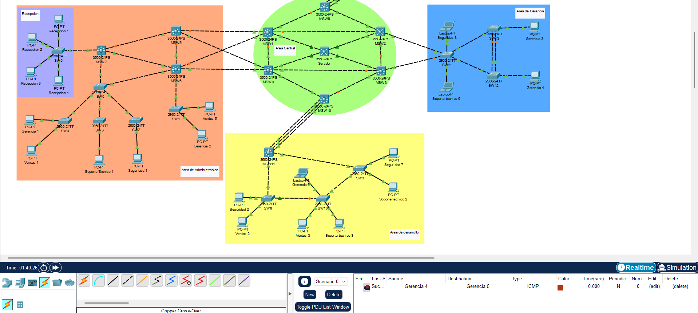
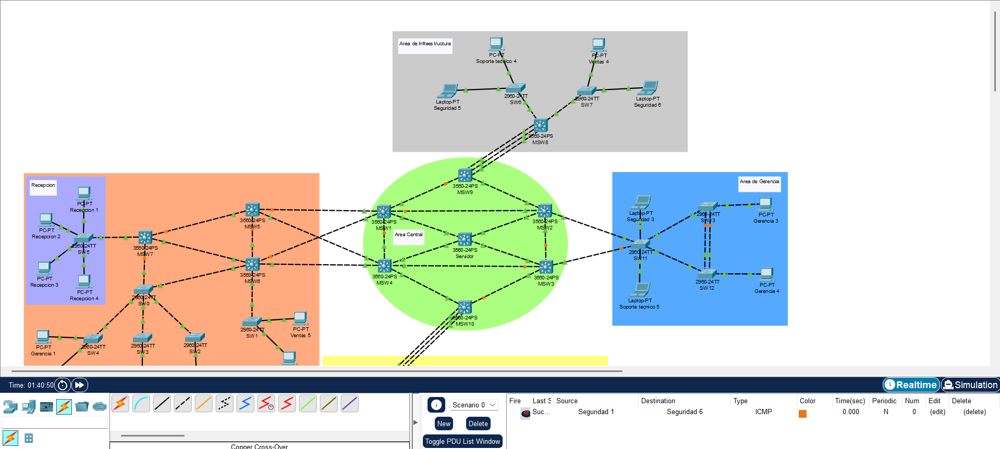

<h1 align="center">📌 PROYECTO 01</h1>

<div align="center"> <strong>🖧 Redes de Computadoras 1</strong>  </div>
<div align="center"> 🏛 Universidad de San Carlos de Guatemala  </div>
<div align="center"> 📆 Primer Semestre - 2025  </div>

### MANUAL TÉCNICO

**Topología de la Red:** 

La red está organizada con los siguientes switches:
  - Servidor VTP (Root Bridge STP)
  - Switches Clientes y Transparentes

<p align="center">
  
</p>

**Resumen de Direcciones IP y VLAN**

Tabla de direccionamiento:

<table>
  <thead>
    <tr>
      <th>VLAN ID</th>
      <th>Nombre</th>
      <th>Red</th>
    </tr>
  </thead>
  <tbody>
    <tr>
      <td>13</td>
      <td>Ventas</td>
      <td>192.168.13.0/24</td>
    </tr>
    <tr>
      <td>23</td>
      <td>Soporte</td>
      <td>192.168.23.0/24</td>
    </tr>
    <tr>
      <td>33</td>
      <td>Gerencia</td>
      <td>192.168.33.0/24</td>
    </tr>
    <tr>
      <td>43</td>
      <td>Seguridad</td>
      <td>192.168.43.0/24</td>
    </tr>
  </tbody>
</table>


| **Vlan** | **Dispositivo** | **IP Asignada** | **Switch Conectado** |
|----------|-----------------|-----------------|----------------------|
|  11      | VENTAS 1        | 192.168.13.11   | SW4                  |
|  11      | VENTAS 2        | 192.168.13.12   | SW8                  |
|  11      | VENTAS 3        | 192.168.13.13   | SW10                 |
|  11      | VENTAS 4        | 192.168.13.14   | SW7                  |
|  11      | VENTAS 5        | 192.168.13.15   | SW1                  |
|  21      | SOPORTE 1       | 192.168.23.11   | SW3                  |
|  21      | SOPORTE 2       | 192.168.23.12   | SW9                  |
|  21      | SOPORTE 3       | 192.168.23.13   | SW10                 |
|  21      | SOPORTE 4       | 192.168.23.14   | SW6                  |
|  21      | SOPORTE 5       | 192.168.23.15   | SW11                 |
|  31      | GERENCIA 1      | 192.168.33.11   | SW4                  |
|  31      | GERENCIA 2      | 192.168.33.12   | SW1                  |
|  31      | GERENCIA 3      | 192.168.33.13   | SW13                 |
|  31      | GERENCIA 4      | 192.168.33.14   | SW12                 |
|  31      | GERENCIA 5      | 192.168.33.15   | SW10                 |
|  41      | SEGURIDAD 1     | 192.168.43.11   | SW2                  |
|  41      | SEGURIDAD 2     | 192.168.43.12   | SW8                  |
|  41      | SEGURIDAD 3     | 192.168.43.13   | SW11                 |
|  41      | SEGURIDAD 5     | 192.168.43.15   | SW6                  |
|  41      | SEGURIDAD 6     | 192.168.43.16   | SW7                  |
|  41      | SEGURIDAD 7     | 192.168.43.17   | SW9                  |
|  51      | RECEPCION 1     | 192.168.53.11   | SW5                  |
|  51      | RECEPCION 2     | 192.168.53.12   | SW5                  |
|  51      | RECEPCION 3     | 192.168.53.13   | SW5                  |
|  51      | RECEPCION 4     | 192.168.53.14   | SW5                  |


Cada PC ha sido asignada a una VLAN específica y cuenta con una dirección IP en la subred correspondiente con máscara 255.255.255.0.

**Configuración de los Switches**
- Configuración del Switch Servidor
```bash
    enable
    configure terminal
    vtp domain G15_technet
    vtp password secure2025
    vtp mode server
    spanning-tree mode pvst
```

**Configuración de las VLANs**
- Las VLANs se crean en el switch Servidor y se propagan automáticamente a los clientes.
```bash
enable
configure terminal
vlan 13
 name Ventas
vlan 23
 name Soporte
vlan 33
 name Gerencia
vlan 43
 name Seguridad
exit
```

**Configuración de Trunking**
- Los enlaces entre switches deben configurarse como trunks para permitir la propagación de VLANs.
```bash
enable
configure terminal
interface range GigabitEthernet0/1 - 2
 switchport mode trunk
 switchport trunk encapsulation dot1q
```

**Configuración de Etherchannel**
```bash
interface port-channel 1
 switchport mode trunk
 switchport trunk encapsulation dot1q
 channel-group 1 mode active  # (LACP para infraestructura, PAGP para desarrollo)
```

**Verificación de Configuración**
- Verificar VTP en los Switches
```bash
show vtp status
```
- Verificar VLANs en cada Switch
```bash
show vlan brief
```
- Verificar Trunking en los Switches
```bash
show interfaces trunk
```

### **Configuración**
#### **Pruebas de Conectividad (Ping)**
 - Ping en VLAN (Ventas)


 - Ping en VLAN (Soporte)


 - Ping en VLAN (Gerencia)


 - Ping en VLAN (Seguridad)
