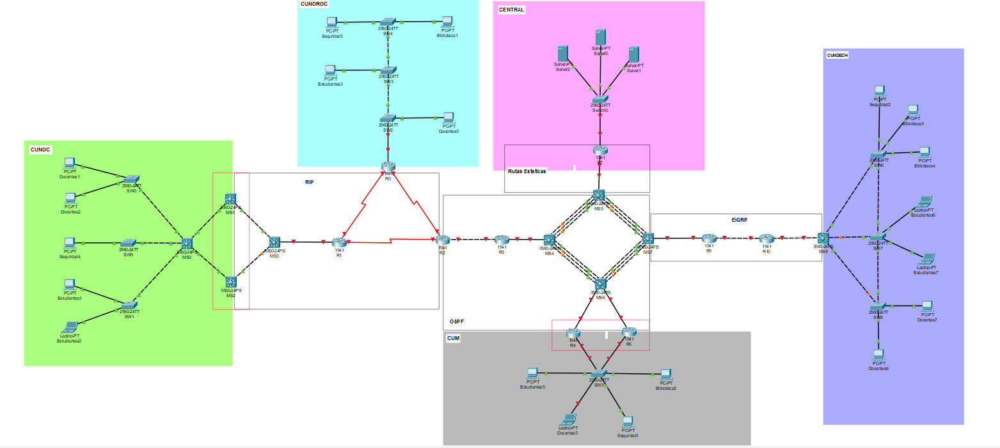

<h1 align="center">📌 PROYECTO 02</h1>

 <strong>🖧 Redes de Computadoras 1</strong>  

 🏛 Universidad de San Carlos de Guatemala  

 📆 Primer Semestre - 2025  

### MANUAL TÉCNICO

<h4 style="color: #007BFF;">Datos Generales</h4>

| **Grupo**      | **15** |
|----------------|--------|
| **Valor de Y** | **3**  |

<h4 style="color: #007BFF;">1. Integrantes del Grupo</h4>

| Nombre                            | Carnet     |
|-----------------------------------|------------|
| Sheila Elizabeth Amaya Rodríguez  | 202000558  |
| Yania Eszter Dávid Cadenas        | 202010175  |

---

<h4 style="color: #007BFF;">2. VLANs por Sede</h4>

###### CUNDECH

| Área        | VLAN ID | Equipos | Red base         |
|-------------|---------|---------|------------------|
| Estudiantes | 13      | 50      | 192.168.15.0/24  |
| Docentes    | 23      | 20      | 192.168.15.0/24  |
| Seguridad   | 33      | 5       | 192.168.15.0/24  |
| Biblioteca  | 43      | 100     | 192.168.15.0/24  |

###### CUNOROC

| Área        | VLAN ID | Equipos | Red base         |
|-------------|---------|---------|------------------|
| Estudiantes | 13      | 45      | 192.148.15.0/24  |
| Docentes    | 23      | 25      | 192.148.15.0/24  |
| Seguridad   | 33      | 10      | 192.148.15.0/24  |
| Biblioteca  | 43      | 75      | 192.148.15.0/24  |

###### CUNOC

| Área        | VLAN ID | Equipos | Red base         |
|-------------|---------|---------|------------------|
| Estudiantes | 13      | 60      | 172.16.15.0/24   |
| Docentes    | 23      | 35      | 172.16.15.0/24   |
| Seguridad   | 33      | 5       | 172.16.15.0/24   |
| Biblioteca  | 43      | 50      | 172.16.15.0/24   |

###### CUM

| Área        | VLAN ID | Equipos | Red base         |
|-------------|---------|---------|------------------|
| Estudiantes | 13      | 45      | 192.158.15.0/24  |
| Docentes    | 23      | 25      | 192.158.15.0/24  |
| Seguridad   | 33      | 10      | 192.158.15.0/24  |
| Biblioteca  | 43      | 75      | 192.158.15.0/24  |

###### CENTRAL

| Servidor | VLAN ID | Equipos | Red base         |
|----------|---------|---------|------------------|
| Server0  | 53      | 60      | 192.125.15.0/24  |
| Server1  | 63      | 35      | 192.126.15.0/24  |
| Server2  | 73      | 5       | 192.127.15.0/24  |
---

<h4 style="color: #007BFF;">3. Protocolos de Enrutamiento</h4>

| Segmento       | Protocolo        | Dispositivos Involucrados                |
|----------------|------------------|------------------------------------------|
| Occidente      | RIP              | MS1, MS2, MS3, R0, R1, R2                |
| Metropolitana  | OSPF             | R2, R3, R4, R5, MS4, MS5, MS6, MS7       |
| Chimaltenango  | EIGRP            | MS7, MS8                                 |
| Central        | Rutas Estáticas  | MS5, R7                                  |

---

<h4 style="color: #007BFF;">4. Direccionamiento y Subneteo</h4>

Se utilizaron los métodos **VLSM** (Variable Length Subnet Mask) y **FLSM** (Fixed Length Subnet Mask) para distribuir las subredes de manera eficiente, según la cantidad de hosts por VLAN.

- **FLSM** se empleó para sedes donde se quería mantener la uniformidad de subredes por facilidad de configuración (como el backbone y servidores).
- **VLSM** se utilizó para aprovechar mejor el espacio de direcciones IP en VLANs con diferentes tamaños de equipos.

### Cálculo VLSM:

| Área        | ID de Red | Máscara CIDR | Máscara Decimal | Wildcard | Primer Host | Último Host | Broadcast | Host Utilizables | Host Requeridos | Desperdiciados |
|-------------|-----------|---------------|------------------|----------|--------------|--------------|------------|-------------------|------------------|------------------|
| Estudiantes |           |               |                  |          |              |              |            |                   |                  |                  |
| Docentes    |           |               |                  |          |              |              |            |                   |                  |                  |
| Seguridad   |           |               |                  |          |              |              |            |                   |                  |                  |
| Biblioteca  |           |               |                  |          |              |              |            |                   |                  |                  |

### Backbone:

| Enlace | ID de Red | Máscara de Subred | Wildcard | Host Utilizables  | Host Requeridos | Desperdiciados  |
|--------|-----------|--------------------|----------|------------------|------------------|----------------|
|        |           |                    |          |                  |                  |                |
|        |           |                    |          |                  |                  |                |
|        |           |                    |          |                  |                  |                |
|        |           |                    |          |                  |                  |                |

---

<h4 style="color: #007BFF;">5. Comandos CLI y Capturas</h4>

- Topologia

 

   
 

 
- Comandos utilizados por router y switch  
- Asignaciones IP por VLAN  
- Configuración de Router-on-a-Stick, HSRP, VRRP, EtherChannel  
- Configuración de VTP por sede  

---
