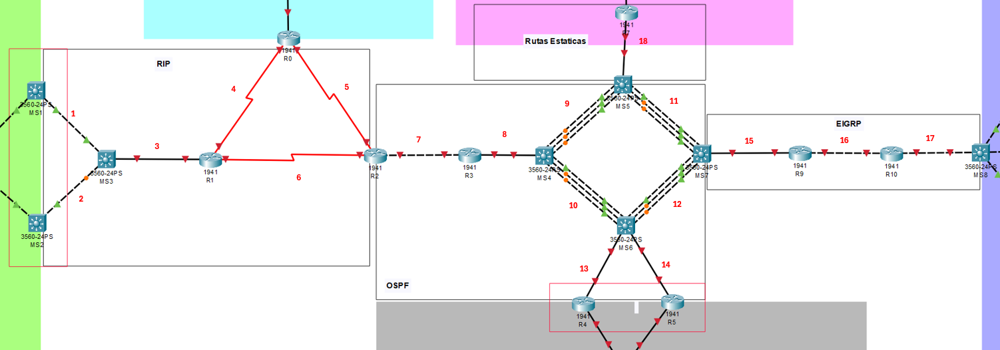

<h1 align="center">📌 PROYECTO 02</h1>

<div align="center"> <strong>🖧 Redes de Computadoras 1</strong>  </div>
<div align="center"> 🏛 Universidad de San Carlos de Guatemala  </div>
<div align="center"> 📆 Primer Semestre - 2025  </div>

#### MANUAL TÉCNICO

### Integrantes:

<table>
  <thead>
    <tr>
      <th>Nombre Completo</th>
      <th>Carnet</th>
    </tr>
  </thead>
  <tbody>
    <tr>
      <td>Sheila Elizabeth Amaya Rodríguez</td>
      <td>202000558</td>
    </tr>
    <tr>
      <td>Yania Eszter Dávid Cadenas</td>
      <td>202010175</td>
    </tr>
  </tbody>
</table>

### Descripción General
Este proyecto consiste en el diseño, segmentación y configuración de una topología de red para interconectar las sedes de la Universidad de San Carlos de Guatemala. Se aplican técnicas de VLAN, VLSM/FLSM, enrutamiento estático y dinámico (RIP, OSPF, EIGRP), y protocolos de redundancia como HSRP/VRRP.

###  Topología General
Incluye la interconexión de:

- CUNDECH
- CUNOROC
- CUNOC
- CUM
- CENTRAL
- CORE/BACKBONE

 <p align="center">
   
 </p>
 

### VLSM por sede
Para cada sede se aplicó VLSM, asignando subredes según el número de equipos por área (estudiantes, docentes, biblioteca, seguridad).

- CUNDECH
<h5>Rango base: 192.168.15.0/24</h5>

<table>
  <thead>
    <tr>
      <th>Área</th>
      <th>ID de Red</th>
      <th>Máscara de Subred</th>
      <th>Wildcard</th>
      <th>Primer Host</th>
      <th>Último Host</th>
      <th>Broadcast</th>
      <th>Host Utilizables</th>
      <th>Host Requeridos</th>
      <th>Desperdiciados</th>
    </tr>
  </thead>
  <tbody>
    <tr>
      <td>Biblioteca</td>
      <td>192.168.15.0</td>
      <td>255.255.255.128</td>
      <td>0.0.0.127</td>
      <td>192.168.15.1</td>
      <td>192.168.15.126</td>
      <td>192.168.15.127</td>
      <td>126</td>
      <td>100</td>
      <td>26</td>
    </tr>
    <tr>
      <td>Estudiantes</td>
      <td>192.168.15.128</td>
      <td>255.255.255.192</td>
      <td>0.0.0.63</td>
      <td>192.168.15.129</td>
      <td>192.168.15.190</td>
      <td>192.168.15.191</td>
      <td>62</td>
      <td>50</td>
      <td>12</td>
    </tr>
    <tr>
      <td>Docentes</td>
      <td>192.168.15.192</td>
      <td>255.255.255.224</td>
      <td>0.0.0.31</td>
      <td>192.168.15.193</td>
      <td>192.168.15.222</td>
      <td>192.168.15.223</td>
      <td>30</td>
      <td>20</td>
      <td>10</td>
    </tr>
    <tr>
      <td>Seguridad</td>
      <td>192.168.15.224</td>
      <td>255.255.255.248</td>
      <td>0.0.0.7</td>
      <td>192.168.15.225</td>
      <td>192.168.15.230</td>
      <td>192.168.15.231</td>
      <td>6</td>
      <td>5</td>
      <td>1</td>
    </tr>
  </tbody>
</table>

- CUNOROC
<h5>Rango base: 192.148.15.0/24</h5>

<table>
  <thead>
    <tr>
      <th>Área</th>
      <th>ID de Red</th>
      <th>Máscara de Subred</th>
      <th>Wildcard</th>
      <th>Primer Host</th>
      <th>Último Host</th>
      <th>Broadcast</th>
      <th>Host Utilizables</th>
      <th>Host Requeridos</th>
      <th>Desperdiciados</th>
    </tr>
  </thead>
  <tbody>
    <tr>
      <td>Biblioteca</td>
      <td>192.148.15.0</td>
      <td>255.255.255.128</td>
      <td>0.0.0.127</td>
      <td>192.148.15.1</td>
      <td>192.148.15.126</td>
      <td>192.148.15.127</td>
      <td>126</td>
      <td>75</td>
      <td>51</td>
    </tr>
    <tr>
      <td>Estudiantes</td>
      <td>192.148.15.128</td>
      <td>255.255.255.192</td>
      <td>0.0.0.63</td>
      <td>192.148.15.129</td>
      <td>192.148.15.190</td>
      <td>192.148.15.191</td>
      <td>62</td>
      <td>45</td>
      <td>17</td>
    </tr>
    <tr>
      <td>Docentes</td>
      <td>192.148.15.192</td>
      <td>255.255.255.224</td>
      <td>0.0.0.31</td>
      <td>192.148.15.193</td>
      <td>192.148.15.222</td>
      <td>192.148.15.223</td>
      <td>30</td>
      <td>25</td>
      <td>5</td>
    </tr>
    <tr>
      <td>Seguridad</td>
      <td>192.148.15.224</td>
      <td>255.255.255.240</td>
      <td>0.0.0.15</td>
      <td>192.148.15.225</td>
      <td>192.148.15.238</td>
      <td>192.148.15.239</td>
      <td>14</td>
      <td>10</td>
      <td>4</td>
    </tr>
  </tbody>
</table>


- CUNOC
<h5>Rango base: 172.16.15.0/24</h5>

<table>
  <thead>
    <tr>
      <th>Área</th>
      <th>ID de Red</th>
      <th>Máscara de Subred</th>
      <th>Wildcard</th>
      <th>Primer Host</th>
      <th>Último Host</th>
      <th>Broadcast</th>
      <th>Host Utilizables</th>
      <th>Host Requeridos</th>
      <th>Desperdiciados</th>
    </tr>
  </thead>
  <tbody>
    <tr>
      <td>Biblioteca</td>
      <td>172.16.15.0</td>
      <td>255.255.255.192</td>
      <td>0.0.0.63</td>
      <td>172.16.15.1</td>
      <td>172.16.15.62</td>
      <td>172.16.15.63</td>
      <td>62</td>
      <td>60</td>
      <td>2</td>
    </tr>
    <tr>
      <td>Estudiantes</td>
      <td>172.16.15.64</td>
      <td>255.255.255.192</td>
      <td>0.0.0.63</td>
      <td>172.16.15.65</td>
      <td>172.16.15.126</td>
      <td>172.16.15.127</td>
      <td>62</td>
      <td>50</td>
      <td>12</td>
    </tr>
    <tr>
      <td>Docentes</td>
      <td>172.16.15.128</td>
      <td>255.255.255.192</td>
      <td>0.0.0.63</td>
      <td>172.16.15.129</td>
      <td>172.16.15.190</td>
      <td>172.16.15.191</td>
      <td>62</td>
      <td>35</td>
      <td>27</td>
    </tr>
    <tr>
      <td>Seguridad</td>
      <td>172.16.15.192</td>
      <td>255.255.255.248</td>
      <td>0.0.0.7</td>
      <td>172.16.15.193</td>
      <td>172.16.15.198</td>
      <td>172.16.15.199</td>
      <td>6</td>
      <td>5</td>
      <td>1</td>
    </tr>
  </tbody>
</table>


- CENTRAL
<h5>Rango base: 192.123.15.0/24</h5>

<table>
  <thead>
    <tr>
      <th>Área</th>
      <th>ID de Red</th>
      <th>Máscara de Subred</th>
      <th>Wildcard</th>
      <th>Primer Host</th>
      <th>Último Host</th>
      <th>Broadcast</th>
      <th>Host Utilizables</th>
      <th>Host Requeridos</th>
      <th>Desperdiciados</th>
    </tr>
  </thead>
  <tbody>
    <tr>
      <td>Server0</td>
      <td>192.123.15.0</td>
      <td>255.255.255.192</td>
      <td>0.0.0.63</td>
      <td>192.123.15.1</td>
      <td>192.123.15.62</td>
      <td>192.123.15.63</td>
      <td>62</td>
      <td>60</td>
      <td>2</td>
    </tr>
    <tr>
      <td>Server1</td>
      <td>192.123.15.64</td>
      <td>255.255.255.192</td>
      <td>0.0.0.63</td>
      <td>192.123.15.65</td>
      <td>192.123.15.126</td>
      <td>192.123.15.127</td>
      <td>62</td>
      <td>35</td>
      <td>27</td>
    </tr>
    <tr>
      <td>Server2</td>
      <td>192.123.15.128</td>
      <td>255.255.255.248</td>
      <td>0.0.0.7</td>
      <td>192.123.15.129</td>
      <td>192.123.15.134</td>
      <td>192.123.15.135</td>
      <td>6</td>
      <td>5</td>
      <td>1</td>
    </tr>
  </tbody>
</table>


- CUM
<h5>Rango base: 192.158.15.0/24</h5>

<table>
  <thead>
    <tr>
      <th>Área</th>
      <th>ID de Red</th>
      <th>Máscara de Subred</th>
      <th>Wildcard</th>
      <th>Primer Host</th>
      <th>Último Host</th>
      <th>Broadcast</th>
      <th>Host Utilizables</th>
      <th>Host Requeridos</th>
      <th>Desperdiciados</th>
    </tr>
  </thead>
  <tbody>
    <tr>
      <td>Biblioteca</td>
      <td>192.158.15.0</td>
      <td>255.255.255.128</td>
      <td>0.0.0.127</td>
      <td>192.158.15.1</td>
      <td>192.158.15.126</td>
      <td>192.158.15.127</td>
      <td>126</td>
      <td>75</td>
      <td>51</td>
    </tr>
    <tr>
      <td>Estudiantes</td>
      <td>192.158.15.128</td>
      <td>255.255.255.192</td>
      <td>0.0.0.63</td>
      <td>192.158.15.129</td>
      <td>192.158.15.190</td>
      <td>192.158.15.191</td>
      <td>62</td>
      <td>45</td>
      <td>17</td>
    </tr>
    <tr>
      <td>Docentes</td>
      <td>192.158.15.192</td>
      <td>255.255.255.224</td>
      <td>0.0.0.31</td>
      <td>192.158.15.193</td>
      <td>192.158.15.222</td>
      <td>192.158.15.223</td>
      <td>30</td>
      <td>25</td>
      <td>5</td>
    </tr>
    <tr>
      <td>Seguridad</td>
      <td>192.158.15.224</td>
      <td>255.255.255.240</td>
      <td>0.0.0.15</td>
      <td>192.158.15.225</td>
      <td>192.158.15.238</td>
      <td>192.158.15.239</td>
      <td>14</td>
      <td>10</td>
      <td>4</td>
    </tr>
  </tbody>
</table>


### FLSM - CORE/BACKBONE
Se implementó FLSM con subredes /30 para los 18 enlaces punto a punto del backbone utilizando el rango 10.0.0.0/24.

 <p align="center">
   
 </p>
 

<h5>Rango base: 10.0.0.0/24</h5>

<table>
  <thead>
    <tr>
      <th>#</th>
      <th>Área</th>
      <th>ID de Red</th>
      <th>Máscara de Subred</th>
      <th>Wildcard</th>
      <th>Primer Host</th>
      <th>Último Host</th>
      <th>Broadcast</th>
      <th>Host Utilizables</th>
      <th>Host Requeridos</th>
      <th>Desperdiciados</th>
    </tr>
  </thead>
  <tbody>
    <tr><td>1</td><td>RIP</td><td>10.0.0.0</td><td>255.255.255.252</td><td>0.0.0.3</td><td>10.0.0.1</td><td>10.0.0.2</td><td>10.0.0.3</td><td>2</td><td>2</td><td>0</td></tr>
    <tr><td>2</td><td>RIP</td><td>10.0.0.4</td><td>255.255.255.252</td><td>0.0.0.3</td><td>10.0.0.5</td><td>10.0.0.6</td><td>10.0.0.7</td><td>2</td><td>2</td><td>0</td></tr>
    <tr><td>3</td><td>RIP</td><td>10.0.0.8</td><td>255.255.255.252</td><td>0.0.0.3</td><td>10.0.0.9</td><td>10.0.0.10</td><td>10.0.0.11</td><td>2</td><td>2</td><td>0</td></tr>
    <tr><td>4</td><td>RIP</td><td>10.0.0.12</td><td>255.255.255.252</td><td>0.0.0.3</td><td>10.0.0.13</td><td>10.0.0.14</td><td>10.0.0.15</td><td>2</td><td>2</td><td>0</td></tr>
    <tr><td>5</td><td>RIP</td><td>10.0.0.16</td><td>255.255.255.252</td><td>0.0.0.3</td><td>10.0.0.17</td><td>10.0.0.18</td><td>10.0.0.19</td><td>2</td><td>2</td><td>0</td></tr>
    <tr><td>6</td><td>RIP</td><td>10.0.0.20</td><td>255.255.255.252</td><td>0.0.0.3</td><td>10.0.0.21</td><td>10.0.0.22</td><td>10.0.0.23</td><td>2</td><td>2</td><td>0</td></tr>
    <tr><td>7</td><td>OSPF</td><td>10.0.0.24</td><td>255.255.255.252</td><td>0.0.0.3</td><td>10.0.0.25</td><td>10.0.0.26</td><td>10.0.0.27</td><td>2</td><td>2</td><td>0</td></tr>
    <tr><td>8</td><td>OSPF</td><td>10.0.0.28</td><td>255.255.255.252</td><td>0.0.0.3</td><td>10.0.0.29</td><td>10.0.0.30</td><td>10.0.0.31</td><td>2</td><td>2</td><td>0</td></tr>
    <tr><td>9</td><td>OSPF</td><td>10.0.0.32</td><td>255.255.255.252</td><td>0.0.0.3</td><td>10.0.0.33</td><td>10.0.0.34</td><td>10.0.0.35</td><td>2</td><td>2</td><td>0</td></tr>
    <tr><td>10</td><td>OSPF</td><td>10.0.0.36</td><td>255.255.255.252</td><td>0.0.0.3</td><td>10.0.0.37</td><td>10.0.0.38</td><td>10.0.0.39</td><td>2</td><td>2</td><td>0</td></tr>
    <tr><td>11</td><td>OSPF</td><td>10.0.0.40</td><td>255.255.255.252</td><td>0.0.0.3</td><td>10.0.0.41</td><td>10.0.0.42</td><td>10.0.0.43</td><td>2</td><td>2</td><td>0</td></tr>
    <tr><td>12</td><td>OSPF</td><td>10.0.0.44</td><td>255.255.255.252</td><td>0.0.0.3</td><td>10.0.0.45</td><td>10.0.0.46</td><td>10.0.0.47</td><td>2</td><td>2</td><td>0</td></tr>
    <tr><td>13</td><td>OSPF</td><td>10.0.0.48</td><td>255.255.255.252</td><td>0.0.0.3</td><td>10.0.0.49</td><td>10.0.0.50</td><td>10.0.0.51</td><td>2</td><td>2</td><td>0</td></tr>
    <tr><td>14</td><td>OSPF</td><td>10.0.0.52</td><td>255.255.255.252</td><td>0.0.0.3</td><td>10.0.0.53</td><td>10.0.0.54</td><td>10.0.0.55</td><td>2</td><td>2</td><td>0</td></tr>
    <tr><td>15</td><td>EIGRP</td><td>10.0.0.56</td><td>255.255.255.252</td><td>0.0.0.3</td><td>10.0.0.57</td><td>10.0.0.58</td><td>10.0.0.59</td><td>2</td><td>2</td><td>0</td></tr>
    <tr><td>16</td><td>EIGRP</td><td>10.0.0.60</td><td>255.255.255.252</td><td>0.0.0.3</td><td>10.0.0.61</td><td>10.0.0.62</td><td>10.0.0.63</td><td>2</td><td>2</td><td>0</td></tr>
    <tr><td>17</td><td>EIGRP</td><td>10.0.0.64</td><td>255.255.255.252</td><td>0.0.0.3</td><td>10.0.0.65</td><td>10.0.0.66</td><td>10.0.0.67</td><td>2</td><td>2</td><td>0</td></tr>
    <tr><td>18</td><td>Rutas Estáticas</td><td>10.0.0.68</td><td>255.255.255.252</td><td>0.0.0.3</td><td>10.0.0.69</td><td>10.0.0.70</td><td>10.0.0.71</td><td>2</td><td>2</td><td>0</td></tr>
  </tbody>
</table>

### Asignación de Direcciones IP por Sede

<h6>CUNDECH</h6>
<table>
  <thead>
    <tr><th>Dispositivo</th><th>VLAN</th><th>IP Asignada</th><th>Máscara</th><th>Gateway</th></tr>
  </thead>
  <tbody>
    <tr><td>Estudiantes6 (laptop)</td><td>13</td><td>192.168.15.130</td><td>255.255.255.192</td><td>192.168.15.129</td></tr>
    <tr><td>Estudiantes7 (laptop)</td><td>13</td><td>192.168.15.131</td><td>255.255.255.192</td><td>192.168.15.129</td></tr>
    <tr><td>Docentes6 (PC)</td><td>23</td><td>192.168.15.194</td><td>255.255.255.224</td><td>192.168.15.193</td></tr>
    <tr><td>Docentes7 (PC)</td><td>23</td><td>192.168.15.195</td><td>255.255.255.224</td><td>192.168.15.193</td></tr>
    <tr><td>Seguridad2 (PC)</td><td>33</td><td>192.168.15.226</td><td>255.255.255.248</td><td>192.168.15.225</td></tr>
    <tr><td>Biblioteca3 (PC)</td><td>43</td><td>192.168.15.2</td><td>255.255.255.128</td><td>192.168.15.1</td></tr>
    <tr><td>Biblioteca4 (PC)</td><td>43</td><td>192.168.15.3</td><td>255.255.255.128</td><td>192.168.15.1</td></tr>
  </tbody>
</table>

<h6>CENTRAL</h6>
<table>
  <thead>
    <tr><th>Servidor</th><th>IP Asignada</th><th>Máscara</th><th>Gateway</th></tr>
  </thead>
  <tbody>
    <tr><td>Server0</td><td>192.123.15.2</td><td>255.255.255.192</td><td>192.123.15.1</td></tr>
    <tr><td>Server1</td><td>192.123.15.66</td><td>255.255.255.192</td><td>192.123.15.65</td></tr>
    <tr><td>Server2</td><td>192.123.15.130</td><td>255.255.255.248</td><td>192.123.15.129</td></tr>
  </tbody>
</table>

<h6>CUNOROC</h6>
<table>
  <thead>
    <tr><th>Dispositivo</th><th>VLAN</th><th>IP Asignada</th><th>Máscara</th><th>Gateway</th></tr>
  </thead>
  <tbody>
    <tr><td>Biblioteca1 (PC)</td><td>43</td><td>192.148.15.2</td><td>255.255.255.128</td><td>192.148.15.1</td></tr>
    <tr><td>Estudiantes3 (PC)</td><td>13</td><td>192.148.15.130</td><td>255.255.255.192</td><td>192.148.15.129</td></tr>
    <tr><td>Docentes3 (PC)</td><td>23</td><td>192.148.15.194</td><td>255.255.255.224</td><td>192.148.15.193</td></tr>
    <tr><td>Seguridad3 (PC)</td><td>33</td><td>192.148.15.226</td><td>255.255.255.240</td><td>192.148.15.225</td></tr>
  </tbody>
</table>

<h6>CUNOC</h6>
<table>
  <thead>
    <tr><th>Dispositivo</th><th>VLAN</th><th>IP Asignada</th><th>Máscara</th><th>Gateway</th></tr>
  </thead>
  <tbody>
    <tr><td>Estudiantes1 (PC)</td><td>13</td><td>172.16.15.66</td><td>255.255.255.192</td><td>172.16.15.65</td></tr>
    <tr><td>Estudiantes2 (Laptop)</td><td>13</td><td>172.16.15.67</td><td>255.255.255.192</td><td>172.16.15.65</td></tr>
    <tr><td>Docentes1 (PC)</td><td>23</td><td>172.16.15.130</td><td>255.255.255.192</td><td>172.16.15.129</td></tr>
    <tr><td>Docentes2 (PC)</td><td>23</td><td>172.16.15.131</td><td>255.255.255.192</td><td>172.16.15.129</td></tr>
    <tr><td>Seguridad4 (PC)</td><td>33</td><td>172.16.15.194</td><td>255.255.255.248</td><td>172.16.15.193</td></tr>
  </tbody>
</table>

<h6>CUM</h6>
<table>
  <thead>
    <tr><th>Dispositivo</th><th>VLAN</th><th>IP Asignada</th><th>Máscara</th><th>Gateway</th></tr>
  </thead>
  <tbody>
    <tr><td>Estudiante5 (PC)</td><td>13</td><td>192.158.15.130</td><td>255.255.255.192</td><td>192.158.15.129</td></tr>
    <tr><td>Docentes5 (Laptop)</td><td>23</td><td>192.158.15.194</td><td>255.255.255.224</td><td>192.158.15.193</td></tr>
    <tr><td>Seguridad1 (PC)</td><td>33</td><td>192.158.15.226</td><td>255.255.255.240</td><td>192.158.15.225</td></tr>
    <tr><td>Biblioteca2 (PC)</td><td>43</td><td>192.158.15.2</td><td>255.255.255.128</td><td>192.158.15.1</td></tr>
  </tbody>
</table>


### Comandos utilizados

SW6
```bash
enable
configure terminal

vtp domain Grupo15
vtp password usac2025
vtp mode client

interface fa0/3
switchport mode access
switchport access vlan 33

interface range fa0/4 - 5
switchport mode access
switchport access vlan 43

interface fa0/1
switchport mode trunk

interface fa0/2
switchport mode trunk

end
write memory

```
CUNDECH
SW7
```bash
enable
configure terminal

vtp domain Grupo15
vtp password usac2025
vtp mode server

vlan 13
name Estudiantes
vlan 23
name Docentes
vlan 33
name Seguridad
vlan 43
name Biblioteca

interface range fa0/4 - 5
switchport mode access
switchport access vlan 13

interface fa0/1
switchport mode trunk

interface fa0/2
switchport mode trunk

interface fa0/3
switchport mode trunk

end
write memory

```

SW8
```bash
enable
configure terminal

vtp domain Grupo15
vtp password usac2025
vtp mode client

interface range fa0/3 - 4
switchport mode access
switchport access vlan 23

interface fa0/1
switchport mode trunk

interface fa0/2
switchport mode trunk

end
write memory

```

MS8
```bash
enable
configure terminal

vtp domain Grupo15
vtp password usac2025
vtp mode client
vtp version 2

ip routing

interface vlan 13
ip address 192.168.15.129 255.255.255.192
no shutdown

interface vlan 23
ip address 192.168.15.193 255.255.255.224
no shutdown

interface vlan 33
ip address 192.168.15.225 255.255.255.248
no shutdown

interface vlan 43
ip address 192.168.15.1 255.255.255.128
no shutdown

interface fa0/2
switchport trunk encapsulation dot1q
switchport mode trunk

interface fa0/3
switchport trunk encapsulation dot1q
switchport mode trunk

interface fa0/4
switchport trunk encapsulation dot1q
switchport mode trunk

interface fa0/1
no switchport
ip address 10.0.0.66 255.255.255.252
no shutdown

router eigrp 15
network 10.0.0.64 0.0.0.3
network 192.168.15.0 0.0.0.255
no auto-summary

end
write memory

```

EIGRP

R10
```bash
enable
configure terminal

interface GigabitEthernet0/0
ip address 10.0.0.62 255.255.255.252
no shutdown

interface GigabitEthernet0/1
ip address 10.0.0.65 255.255.255.252
no shutdown

router eigrp 15
network 10.0.0.60 0.0.0.3
network 10.0.0.64 0.0.0.3
no auto-summary

end
write memory

```

R9
```bash
enable
configure terminal

interface GigabitEthernet0/0
ip address 10.0.0.58 255.255.255.252
no shutdown

interface GigabitEthernet0/1
ip address 10.0.0.61 255.255.255.252
no shutdown

router eigrp 15
network 10.0.0.56 0.0.0.3
network 10.0.0.60 0.0.0.3
no auto-summary

end
write memory

```

OSPF
MS7
  ```bash
enable
configure terminal

vtp domain Grupo15
vtp password usac2025
vtp mode client
vtp version 2

ip routing

default interface range fa0/4 - 6
interface range fa0/4 - 6
no switchport
channel-group 11 mode active
no shutdown
exit

interface port-channel11
no switchport
ip address 10.0.0.42 255.255.255.252
no shutdown

interface range fa0/1 - 3
no switchport
channel-group 12 mode active
no shutdown
exit

interface port-channel12
no switchport
ip address 10.0.0.45 255.255.255.252
no shutdown

interface fa0/7
no switchport
ip address 10.0.0.57 255.255.255.252
no shutdown

router ospf 1
router-id 10.0.0.42
network 10.0.0.40 0.0.0.3 area 0
network 10.0.0.44 0.0.0.3 area 0
redistribute eigrp 15 subnets

router eigrp 15
network 10.0.0.56 0.0.0.3
network 10.0.0.60 0.0.0.3
redistribute ospf 1 metric 10000 1 255 1 1500
no auto-summary

end
write memory

```

MS5
```bash
enable
configure terminal

vtp domain Grupo15
vtp password usac2025
vtp mode client
vtp version 2

ip routing

default interface range fa0/4 - 6
interface range fa0/4 - 6
no switchport
channel-group 9 mode active
no shutdown
exit

interface port-channel9
no switchport
ip address 10.0.0.33 255.255.255.252
no shutdown

default interface range fa0/1 - 3
interface range fa0/1 - 3
no switchport
channel-group 11 mode active
no shutdown
exit

interface port-channel11
no switchport
ip address 10.0.0.41 255.255.255.252
no shutdown

interface fa0/7
no switchport
ip address 10.0.0.70 255.255.255.252
no shutdown

ip route 192.123.15.0 255.255.255.0 10.0.0.70

router ospf 1
router-id 10.0.0.33
network 10.0.0.32 0.0.0.3 area 0
network 10.0.0.40 0.0.0.3 area 0
redistribute static subnets

end
write memory

```

MS4
```bash
enable
configure terminal

vtp domain Grupo15
vtp password usac2025
vtp mode client
vtp version 2

ip routing

interface fa0/7
no switchport
ip address 10.0.0.30 255.255.255.252
no shutdown

interface range fa0/1 - 3
channel-group 9 mode active
exit
interface port-channel9
no switchport
ip address 10.0.0.34 255.255.255.252
no shutdown

interface range fa0/4 - 6
channel-group 10 mode active
exit
interface port-channel10
no switchport
ip address 10.0.0.37 255.255.255.252
no shutdown

router ospf 1
network 10.0.0.28 0.0.0.3 area 0
network 10.0.0.32 0.0.0.3 area 0
network 10.0.0.36 0.0.0.3 area 0

end
write memory

```

MS6
```bash
enable
configure terminal

vtp domain Grupo15
vtp password usac2025
vtp mode client
vtp version 2

ip routing

interface range fa0/4 - 6
channel-group 10 mode active
exit
interface port-channel10
no switchport
ip address 10.0.0.38 255.255.255.252
no shutdown

interface range fa0/1 - 3
channel-group 12 mode active
exit
interface port-channel12
no switchport
ip address 10.0.0.46 255.255.255.252
no shutdown

interface fa0/8
no switchport
ip address 10.0.0.49 255.255.255.252
no shutdown

interface fa0/7
no switchport
ip address 10.0.0.53 255.255.255.252
no shutdown

router ospf 1
network 10.0.0.36 0.0.0.3 area 0
network 10.0.0.44 0.0.0.3 area 0
network 10.0.0.48 0.0.0.3 area 0
network 10.0.0.52 0.0.0.3 area 0

end
write memory

```

R3
```bash
enable
configure terminal

interface GigabitEthernet0/1
ip address 10.0.0.26 255.255.255.252
no shutdown

interface GigabitEthernet0/0
ip address 10.0.0.29 255.255.255.252
no shutdown

router ospf 1
network 10.0.0.24 0.0.0.3 area 0
network 10.0.0.28 0.0.0.3 area 0

end
write memory

```

R2
```bash
enable
configure terminal

interface Serial0/0/1
ip address 10.0.0.18 255.255.255.252
no shutdown

interface Serial0/0/0
ip address 10.0.0.21 255.255.255.252
clock rate 64000
no shutdown

interface GigabitEthernet0/0
ip address 10.0.0.25 255.255.255.252
no shutdown

router rip
version 2
network 10.0.0.0
redistribute ospf 1
no auto-summary

router ospf 1
network 10.0.0.24 0.0.0.3 area 0
redistribute rip subnets

end
write memory

```

R1
```bash
enable
configure terminal

interface GigabitEthernet0/0
ip address 10.0.0.9 255.255.255.252
no shutdown

interface Serial0/0/0
ip address 10.0.0.13 255.255.255.252
no shutdown

interface Serial0/0/1
ip address 10.0.0.21 255.255.255.252
clock rate 64000
no shutdown

router rip
version 2
network 10.0.0.0
no auto-summary

end
write memory

```

R0
```bash
enable
configure terminal

ip routing

interface GigabitEthernet0/0.13
encapsulation dot1Q 13
ip address 192.148.15.129 255.255.255.192
no shutdown

interface GigabitEthernet0/0.23
encapsulation dot1Q 23
ip address 192.148.15.193 255.255.255.224
no shutdown

interface GigabitEthernet0/0.33
encapsulation dot1Q 33
ip address 192.148.15.225 255.255.255.240
no shutdown

interface GigabitEthernet0/0.43
encapsulation dot1Q 43
ip address 192.148.15.1 255.255.255.128
no shutdown

interface GigabitEthernet0/0
no shutdown

interface Serial0/0/0
ip address 10.0.0.14 255.255.255.252
no shutdown

interface Serial0/0/1
ip address 10.0.0.17 255.255.255.252
clock rate 64000
no shutdown

router rip
version 2
network 10.0.0.0
network 192.148.15.0
no auto-summary

end
write memory

```

MS3
```bash
enable
configure terminal

vtp domain Grupo15
vtp password usac2025
vtp mode client

ip routing

interface fa0/2
no switchport
ip address 10.0.0.2 255.255.255.252
no shutdown

interface fa0/3
no switchport
ip address 10.0.0.6 255.255.255.252
no shutdown

interface fa0/1
no switchport
ip address 10.0.0.10 255.255.255.252
no shutdown

router rip
version 2
network 10.0.0.0
no auto-summary

end
write memory

```

MS1
```bash
enable
configure terminal

vtp domain Grupo15
vtp password usac2025
vtp mode client

ip routing

interface fa0/1
no switchport
ip address 10.0.0.1 255.255.255.252
no shutdown

interface fa0/2
switchport mode trunk
no shutdown

router rip
version 2
network 10.0.0.0
no auto-summary

end
write memory

```

MS2
```bash
enable
configure terminal

vtp domain Grupo15
vtp password usac2025
vtp mode client

ip routing

interface fa0/1
no switchport
ip address 10.0.0.5 255.255.255.252
no shutdown

interface fa0/2
switchport mode trunk
no shutdown

router rip
version 2
network 10.0.0.0
no auto-summary

end
write memory

```

CUNOC
MS0
```bash
enable
configure terminal

vtp domain Grupo15
vtp password usac2025
vtp mode server

ip routing

vlan 13
name Estudiantes
vlan 23
name Docentes
vlan 33
name Seguridad
vlan 43
name Biblioteca

interface vlan 13
ip address 172.16.15.65 255.255.255.192
no shutdown

interface vlan 23
ip address 172.16.15.129 255.255.255.192
no shutdown

interface vlan 33
ip address 172.16.15.193 255.255.255.248
no shutdown

! Si deseas enrutar Biblioteca localmente, descomenta esta parte
! interface vlan 43
! ip address 172.16.15.1 255.255.255.128
! no shutdown

interface range fa0/3 - 5
switchport mode trunk

interface fa0/1
no switchport
ip address 10.0.0.1 255.255.255.252
no shutdown

interface fa0/2
no switchport
ip address 10.0.0.5 255.255.255.252
no shutdown

router rip
version 2
network 10.0.0.0
network 172.16.15.0
no auto-summary

end
write memory

```

SW0 
```bash
enable
configure terminal

vtp domain Grupo15
vtp password usac2025
vtp mode client

interface fa0/3
switchport mode access
switchport access vlan 23

interface fa0/2
switchport mode access
switchport access vlan 23

interface fa0/1
switchport mode trunk

end
write memory

```

SW9
```bash
enable
configure terminal

vtp domain Grupo15
vtp password usac2025
vtp mode client

interface fa0/2
switchport mode access
switchport access vlan 33

interface fa0/1
switchport mode trunk

end
write memory

```

SW1
```bash
enable
configure terminal

vtp domain Grupo15
vtp password usac2025
vtp mode client

interface fa0/2
switchport mode access
switchport access vlan 13

interface fa0/3
switchport mode access
switchport access vlan 13

interface fa0/1
switchport mode trunk

end
write memory

```

CUM
R4
```bash
enable
configure terminal

interface GigabitEthernet0/0
ip address 10.0.0.50 255.255.255.252
no shutdown

interface GigabitEthernet0/1.13
encapsulation dot1Q 13
ip address 192.158.15.129 255.255.255.192
standby 13 ip 192.158.15.126
standby 13 priority 110
standby 13 preempt
no shutdown

interface GigabitEthernet0/1.23
encapsulation dot1Q 23
ip address 192.158.15.193 255.255.255.224
standby 23 ip 192.158.15.190
standby 23 priority 110
standby 23 preempt
no shutdown

interface GigabitEthernet0/1.33
encapsulation dot1Q 33
ip address 192.158.15.225 255.255.255.240
standby 33 ip 192.158.15.254
standby 33 priority 110
standby 33 preempt
no shutdown

interface GigabitEthernet0/1.43
encapsulation dot1Q 43
ip address 192.158.15.1 255.255.255.128
standby 43 ip 192.158.15.3
standby 43 priority 110
standby 43 preempt
no shutdown

interface GigabitEthernet0/1
no shutdown

router ospf 1
network 10.0.0.48 0.0.0.3 area 0
network 192.158.15.0 0.0.0.255 area 0

end
write memory

```

R5
```bash
enable
configure terminal

interface GigabitEthernet0/0
ip address 10.0.0.54 255.255.255.252
no shutdown

interface GigabitEthernet0/1.13
encapsulation dot1Q 13
ip address 192.158.15.130 255.255.255.192
standby 13 ip 192.158.15.126
standby 13 priority 100
standby 13 preempt
no shutdown

interface GigabitEthernet0/1.23
encapsulation dot1Q 23
ip address 192.158.15.194 255.255.255.224
standby 23 ip 192.158.15.190
standby 23 priority 100
standby 23 preempt
no shutdown

interface GigabitEthernet0/1.33
encapsulation dot1Q 33
ip address 192.158.15.226 255.255.255.240
standby 33 ip 192.158.15.254
standby 33 priority 100
standby 33 preempt
no shutdown

interface GigabitEthernet0/1.43
encapsulation dot1Q 43
ip address 192.158.15.2 255.255.255.128
standby 43 ip 192.158.15.3
standby 43 priority 100
standby 43 preempt
no shutdown

interface GigabitEthernet0/1
no shutdown

router ospf 1
network 10.0.0.52 0.0.0.3 area 0
network 192.158.15.0 0.0.0.255 area 0

end
write memory

```

SW5
```bash
enable
configure terminal

vtp domain Grupo15
vtp password usac2025
vtp mode transparent

vlan 13
name Estudiantes
exit

vlan 23
name Docentes
exit

vlan 33
name Seguridad
exit

vlan 43
name Biblioteca
exit

interface fa0/4
switchport mode access
switchport access vlan 13

interface fa0/6
switchport mode access
switchport access vlan 23

interface fa0/5
switchport mode access
switchport access vlan 33

interface fa0/3
switchport mode access
switchport access vlan 43

interface fa0/1
switchport mode trunk

interface fa0/2
switchport mode trunk

end
write memory

```

CENTRAL 
R7
```bash
enable
configure terminal

ip routing

interface GigabitEthernet0/1.53
encapsulation dot1Q 53
ip address 192.123.15.1 255.255.255.192
no shutdown

interface GigabitEthernet0/1.63
encapsulation dot1Q 63
ip address 192.123.15.66 255.255.255.192
no shutdown

interface GigabitEthernet0/1.73
encapsulation dot1Q 73
ip address 192.123.15.130 255.255.255.248
no shutdown

interface GigabitEthernet0/1
no shutdown

interface GigabitEthernet0/0
ip address 10.0.0.69 255.255.255.252
no shutdown

ip route 192.168.15.0 255.255.255.0 10.0.0.70
ip route 192.148.15.0 255.255.255.0 10.0.0.70
ip route 172.16.15.0 255.255.255.0 10.0.0.70
ip route 192.158.15.0 255.255.255.0 10.0.0.70
ip route 10.0.0.0 255.255.255.0 10.0.0.70

end
write memory

```

switch0
```bash
enable
configure terminal

vtp domain Grupo15
vtp password usac2025
vtp mode client

interface fa0/2
switchport mode access
switchport access vlan 63

interface fa0/3
switchport mode access
switchport access vlan 53

interface fa0/4
switchport mode access
switchport access vlan 73

interface fa0/1
switchport mode trunk

end
write memory


```

CUNOROC
SW2
```bash
enable
configure terminal

vtp domain Grupo15
vtp password usac2025
vtp mode client

interface fa0/1
switchport mode trunk

interface fa0/3
switchport mode access
switchport access vlan 23

end
write memory

```

SW3
```bash
enable
configure terminal

vtp domain Grupo15
vtp password usac2025
vtp mode server

vlan 13
name Estudiantes
vlan 23
name Docentes
vlan 33
name Seguridad
vlan 43
name Biblioteca

interface fa0/1
switchport mode trunk

interface fa0/2
switchport mode trunk

interface fa0/3
switchport mode access
switchport access vlan 13

end
write memory

```

SW4
```bash
enable
configure terminal

vtp domain Grupo15
vtp password usac2025
vtp mode client

interface fa0/1
switchport mode trunk

interface fa0/2
switchport mode access
switchport access vlan 43

interface fa0/3
switchport mode access
switchport access vlan 33

end
write memory

```

